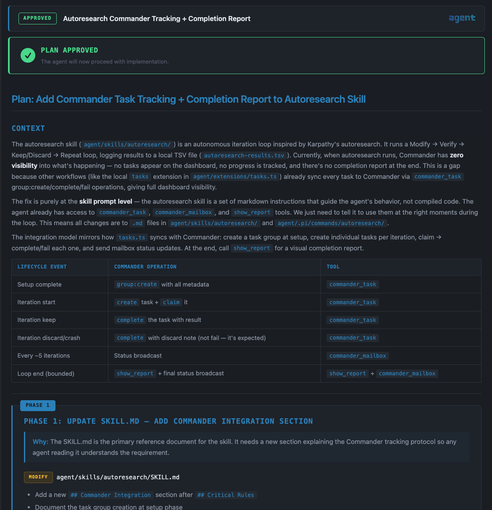
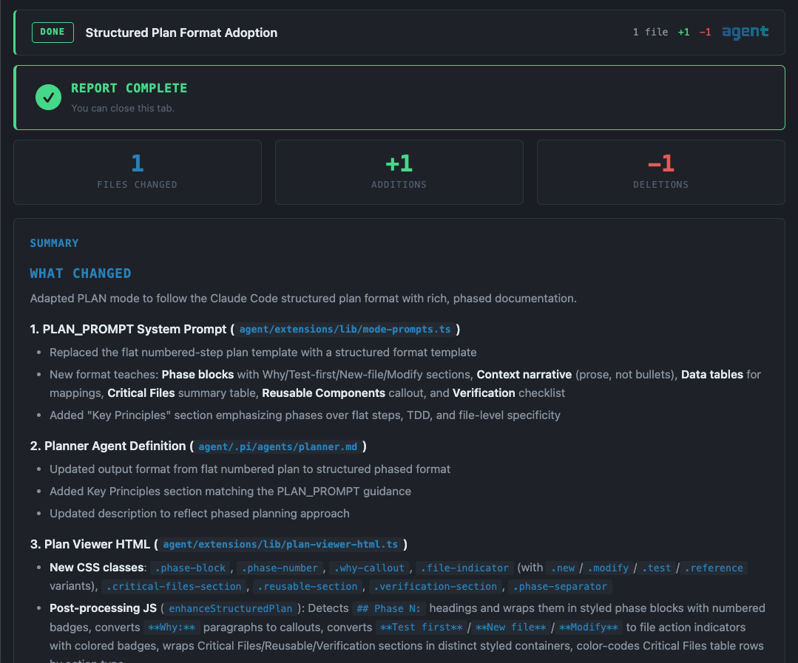

<div align="center">


<br/>

**An extension suite that turns [Pi](https://github.com/badlogic/pi-mono) into a multi-agent orchestration platform**

[Install](#install) · [Extensions](#extensions) · [Modes](#operational-modes) · [Orchestration](#multi-agent-orchestration)

</div>

---

## What is this?

[Pi](https://github.com/badlogic/pi-mono) is a terminal-based AI coding agent by [@badlogic](https://github.com/badlogic). Out of the box it's a single-agent assistant with tool use, conversation memory, and a TUI.

**agent** is a Pi package — **44 extensions, 11 themes, and 20+ skills** that transform Pi into something more:

- **6 operational modes** — NORMAL, PLAN, SPEC, PIPELINE, TEAM, CHAIN
- **Multi-agent orchestration** — dispatch teams, run sequential chains, or execute parallel pipelines
- **Security hardened** — pre-tool-hook guard blocks destructive commands, detects prompt injection, prevents data exfiltration
- **Browser-based viewers** — interactive plan review, completion reports with rollback, spec approval with inline comments
- **11 themes** — Catppuccin, Dracula, Nord, Synthwave, Tokyo Night, and more

Pi itself is unmodified — Pi is consumed as a published npm package; this repo is the package layer.

## About this fork

This is **`krjoha/agent-pi`**, a personal fork of the upstream agent-pi suite. It diverges from upstream in a few intentional ways — see [`docs/workflow-architecture.md`](docs/workflow-architecture.md) for the full design:

- **Providers:** Berget.AI (EU cloud) + a local SGLang server running Qwen3.6-35B. No Anthropic / Claude routing anywhere.
- **Workflow:** A three-phase **Plan → Build → Ship** chain set with explicit human gates between phases.
- **Parallel review:** A `sgl-fork-review` skill that runs four review personas (correctness, security, performance, DRY) against the SGLang radix cache in parallel, with XGrammar-enforced JSON output.
- **Toolkit family removed:** the `cursor-agent` / `codex-agent` / `gemini-agent` / etc. simulator agents are gone — they don't fit a personal workflow.

## Install

### One-line installer (recommended)

Don't have Pi installed? The installer pulls in upstream Pi (`@earendil-works/pi-coding-agent` from npm), registers this checkout as a Pi package, and configures startup defaults:

```bash
git clone https://github.com/krjoha/agent-pi.git && cd agent-pi && ./install.sh
```

The installer never publishes or modifies the fork — it adds the local checkout path to `~/.pi/agent/settings.json` so Pi loads extensions, skills, and agents from your working tree on every run.

### Already have Pi?

```bash
pi install git:github.com/krjoha/agent-pi
```

Pi discovers all extensions, themes, and skills automatically.

### Fresh-machine bootstrap

The full sequence to reproduce this setup on a new computer. Do the steps in order.

#### 1. Clone and run the installer

```bash
git clone https://github.com/krjoha/agent-pi.git
cd agent-pi
./install.sh
```

This installs Node deps, the Pi CLI (`@earendil-works/pi-coding-agent` global) if missing, and registers this checkout as a Pi package in `~/.pi/agent/settings.json`.

#### 2. Connect Berget.AI

```bash
npx berget code init
```

Pick **Pi** when asked which tool. The wizard will:

- install `npm:@bergetai/pi-provider` into your Pi packages list,
- open your browser for OAuth (Keycloak; callback at `http://127.0.0.1:8787/callback`),
- ask whether to set Berget as your default provider — answer **yes**,
- ask whether to set up an agent for Pi — answer **no** (this repo already provides one).

This populates `defaultProvider: "berget"` in `~/.pi/agent/settings.json`. The Berget model catalogue is then live-fetched at every session start — no hand-maintained list.

#### 3. Pick the default model

Edit `~/.pi/agent/settings.json` and set:

```json
"defaultModel": "moonshotai/Kimi-K2.6"
```

Any model id from `https://api.berget.ai/v1/models` works (Kimi-K2.6, GLM-4.7-FP8, Gemma-4-31B-it, Mistral-Medium-3.5, gpt-oss-120b, Llama-3.3-70B, …).

#### 4. Install the CodeScene Code Health MCP binary

This is the [`@codescene/codehealth-mcp`](https://www.npmjs.com/package/@codescene/codehealth-mcp) npm package — the same MCP server is the official entry point for any CodeScene subscription, but the tools you can actually call depend on what your access token unlocks. A Code Health subscription gives you `code_health_score`, `code_health_review`, `pre_commit_code_health_safeguard`, and `analyze_change_set` — which is exactly what `extensions/codescene-mcp.ts` and the `health-gate` agent use.

```bash
npm install -g @codescene/codehealth-mcp
```

This puts a `cs-mcp` binary on your `$PATH`, which `extensions/codescene-mcp.ts` resolves automatically. Alternatives (Homebrew, direct release download, Docker) are covered in the [upstream installation guide](https://github.com/codescene-oss/codescene-mcp-server#installation).

Then write your CodeScene access token to `~/.config/codehealth-mcp/config.json`:

```json
{
  "instance_id": "<your-instance-uuid>",
  "access_token": "<your-jwt-from-codescene>"
}
```

`chmod 600 ~/.config/codehealth-mcp/config.json`. The token comes from your CodeScene account — log into the CodeScene web UI, generate an MCP access token, paste it here. `CS_ACCESS_TOKEN` env var also works as a fallback.

To confirm: start Pi, look for `CodeScene: ready` in the status bar, then ask "score this file: extensions/agent-chain.ts" — the agent should call `code_health_score` directly.

#### 5. (Optional) SGLang local inference server

Only if you run your own SGLang server (e.g. on a homelab GPU). Make sure it's reachable at the URL in `extensions/providers-sglang.ts` (default `http://10.99.99.85:8003/v1`, Tailnet-only), or edit that file for your host. The default model is `RedHatAI/Qwen3.6-35B-A3B-NVFP4`.

For the `sgl-fork-review` skill (used by `local-review` and `code-review` chains), the server must be in **NEXTN speculative** or **high-concurrency** mode — DFLASH speculative doesn't support XGrammar grammar-constrained decoding.

If you don't have an SGLang server, the extension still loads — it just exposes a provider that nothing reaches.

#### 6. Launch and verify

```bash
pi
```

Quick checks:

- Status bar shows `Berget AI · moonshotai/Kimi-K2.6` (or whatever you picked in step 3).
- `/chain-list` enumerates `plan`, `plan-refine`, `build-test`, `local-review`, `code-review`, `investigate-fix`, `test-fix`, plus the older `audit`, `performance`, `secure`, `sentry-*`, `network-security-local`.
- Status bar shows `CodeScene: ready` (if step 4 succeeded).
- `pi --list-models` shows Berget's full live catalogue plus `sglang/RedHatAI/Qwen3.6-35B-A3B-NVFP4` (if step 5 applies).

Personal preference: set `"theme": "nord"` in `~/.pi/agent/settings.json` for the dark blue palette. Cycle live with **F5** (or **F6** for previous), or use `/theme` to pick from the list.

For day-to-day workflow commands, read [`docs/workflow-cheatsheet.md`](docs/workflow-cheatsheet.md).

### First Steps

1. **Type a task** — Pi operates in plan-first mode. It will ask you to define tasks before using tools.
2. **Shift+Tab** — Cycle through operational modes (NORMAL → PLAN → SPEC → PIPELINE → TEAM → CHAIN)
3. **F5** — Cycle themes
4. **`/agents-team`** — Switch between agent teams
5. **`/chain`** — Switch between chain workflows. Three phase-aligned chains: `plan`, `build-test`, `local-review`.
6. **`/tex`** — Open Text Tools in the browser

## Package Structure

```
├── package.json         Pi package manifest
├── extensions/          43 TypeScript extensions + lib/
├── themes/              11 custom terminal themes
├── skills/              20+ skill packs
├── agents/              Agent definitions + chain/pipeline/team YAML
├── commands/            Toolkit slash commands
├── prompts/             Prompt templates
└── tex/                 Text Tools — standalone text manipulation app
```

## Extensions

### Core UI

| Extension | Description |
|-----------|-------------|
| **agent-banner** | ASCII art banner on startup, auto-hides on first input |
| **footer** | Status bar — model name, context %, working directory |
| **agent-nav** | F1-F4 navigation shared across agent widgets |
| **theme-cycler** | F5 to cycle through installed themes |
| **escape-cancel** | Double-ESC cancels all running operations |

### Task Management

| Extension | Description |
|-----------|-------------|
| **tasks** | Task discipline — define tasks before tools unlock; idle → inprogress → done lifecycle |
| **commander-mcp** | Bridge exposing Commander dashboard tools as native Pi tools |
| **commander-tracker** | Reconciles local tasks with Commander; retries failed sync |

### Operational Modes

| Extension | Description |
|-----------|-------------|
| **mode-cycler** | Shift+Tab cycles NORMAL / PLAN / SPEC / PIPELINE / TEAM / CHAIN |

Each mode injects a tailored system prompt. PLAN mode enforces plan-first workflow. SPEC mode drives spec-driven development. TEAM/CHAIN/PIPELINE modes activate their respective orchestration systems.

### Multi-Agent Orchestration

| Extension | Description |
|-----------|-------------|
| **agent-team** | Dispatch-only orchestrator — primary agent delegates to specialists via `dispatch_agent` |
| **agent-chain** | Sequential pipeline — each step's output feeds into the next via `$INPUT` |
| **pipeline-team** | 5-phase hybrid — UNDERSTAND → GATHER → PLAN → EXECUTE → REVIEW |
| **subagent-widget** | Background subagent management with live status widgets |
| **toolkit-commands** | Dynamic slash commands from markdown files |

### Security

| Extension | Description |
|-----------|-------------|
| **security-guard** | Pre-tool-hook: blocks `rm -rf`, `sudo`, credential theft, prompt injection |
| **secure** | `/secure` — full AI security sweep + protection installer for any project |
| **message-integrity-guard** | Prevents session-bricking from orphaned tool_result messages |

### Viewers & Reports

| Extension | Description |
|-----------|-------------|
| **plan-viewer** | Browser GUI — plan approval with checkboxes, reordering, inline editing |
| **completion-report** | Browser GUI — work summary, unified diffs, per-file rollback |
| **spec-viewer** | Browser GUI — multi-page spec review with comments and visual gallery |
| **file-viewer** | Browser GUI — syntax-highlighted file viewer with optional editing |
| **reports-viewer** | Searchable `/reports` browser view for all persisted artifacts |

<div align="center">

<br/><em>Plan Viewer — structured plan with approval controls, phase blocks, and inline code references</em>
</div>

<div align="center">

<br/><em>Completion Report — file change stats, work summary, and per-file rollback</em>
</div>

### Developer Tools

| Extension | Description |
|-----------|-------------|
| **debug-capture** | VHS-based terminal screenshots for visual TUI debugging |
| **web-test** | Cloudflare Browser Rendering — screenshots, content extraction, a11y audits |
| **tool-registry** | In-memory index of all tools with categories and search |
| **tool-search** | Meta-tool — discover and inspect tools at runtime |
| **tool-caller** | Meta-tool — invoke any tool programmatically (dynamic composition) |
| **lean-tools** | Toggle lean mode — agent uses `tool_search` + `call_tool` instead of all tools |

### Session & Context

| Extension | Description |
|-----------|-------------|
| **memory-cycle** | Memory-aware compaction — saves/restores context across compaction |
| **session-replay** | `/replay` — scrollable timeline of conversation history |
| **system-select** | `/system` — switch system prompt by picking agent definitions |

## Operational Modes

| Mode | Trigger | Behavior |
|------|---------|----------|
| **NORMAL** | Default | Standard coding assistant |
| **PLAN** | Shift+Tab | Plan-first workflow — analyze → plan → approve → implement → report |
| **SPEC** | Shift+Tab | Spec-driven — shape → requirements → tasks → implement |
| **TEAM** | Shift+Tab | Dispatcher mode — primary delegates, specialists execute |
| **CHAIN** | Shift+Tab | Sequential pipeline — step outputs chain into next step |
| **PIPELINE** | Shift+Tab | 5-phase hybrid with parallel dispatch |

## Multi-Agent Orchestration

### Teams

Teams are defined in `agents/teams.yaml`. Each team is a list of agent names. Agent definitions live in `agents/*.md` with YAML frontmatter.

```yaml
plan-build:
  - planner
  - builder
  - reviewer
```

### Chains

Chains are sequential pipelines defined in `agents/agent-chain.yaml`. Each step specifies an agent and a prompt template with `$INPUT` (previous output) and `$ORIGINAL` (user's original prompt).

```yaml
plan-build-review:
  description: "Plan, implement, and review"
  steps:
    - agent: planner
      prompt: "Plan the implementation for: $INPUT"
    - agent: builder
      prompt: "Implement the following plan:\n\n$INPUT"
    - agent: reviewer
      prompt: "Review this implementation:\n\n$INPUT"
```

### Pipelines

Pipelines are defined in `agents/pipeline-team.yaml` and combine sequential phases with parallel agent dispatch.

## Security

The security system operates at three layers:

1. **`tool_call` hook** — Pre-execution gate blocks dangerous commands before they run
2. **`context` hook** — Content scanner strips prompt injections from tool results
3. **`before_agent_start` hook** — System prompt hardening reminds the agent of security rules

The `/secure` command runs a comprehensive AI security sweep on any project and can install portable protections.

## Themes

11 themes included. Cycle with **F5** (F6 for previous):

Catppuccin Mocha · Cyberpunk · Dracula · Everforest · Gruvbox · Midnight Ocean · Nord · Ocean Breeze · Rose Pine · Synthwave · Tokyo Night

## Text Tools

A lightweight, zero-dependency text manipulation app bundled in `tex/`. Open it with `/tex` or directly at `tex/index.html`.

- **15 stackable operations** — trim, dedupe, sort, case transforms, regex replace, and more
- **Before/after diff view** — see exactly what changed
- **No backend, no build step** — single HTML page, works offline
- **Dark theme** — matches the terminal aesthetic

## Troubleshooting

| Problem | Fix |
|---------|-----|
| Extensions not loading | `pi install git:github.com/ruizrica/agent-pi` — reinstall the package |
| No themes available | Same as above — themes are auto-discovered from the package |
| Shift+Tab not working | Ensure mode-cycler extension loaded — check `pi config` |
| No chains/pipelines | Agent configs at `agents/` are loaded automatically by extensions |

## Built on Pi

This project is a configuration and extension layer for [Pi Coding Agent](https://github.com/badlogic/pi-mono) by Mario Zechner ([@badlogic](https://github.com/badlogic)). Pi provides the core runtime, TUI framework, LLM integration, and extension API.

---

By [Ricardo Ruiz](https://ruizrica.io)

Inspired by the work of [IndyDevDan](https://www.youtube.com/@indydevdan) — check out his [excellent video on Pi](https://youtu.be/f8cfH5XX-XU?si=RcZoSAKeASaU-lPM) that helped shape this project.

## License

[MIT](LICENSE)
